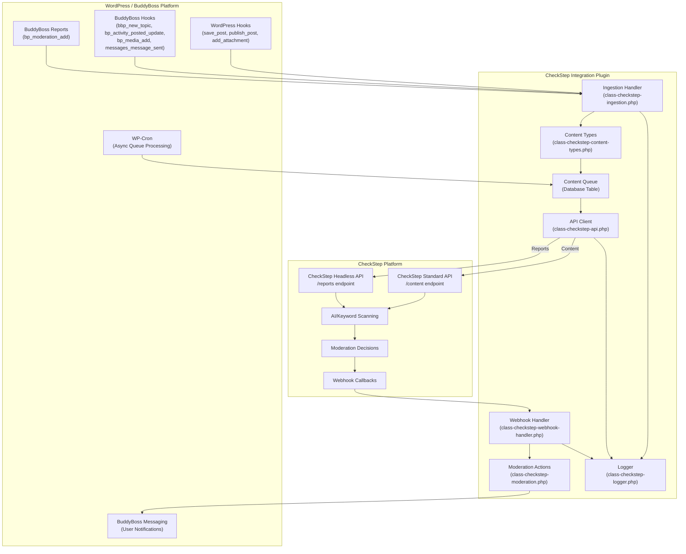
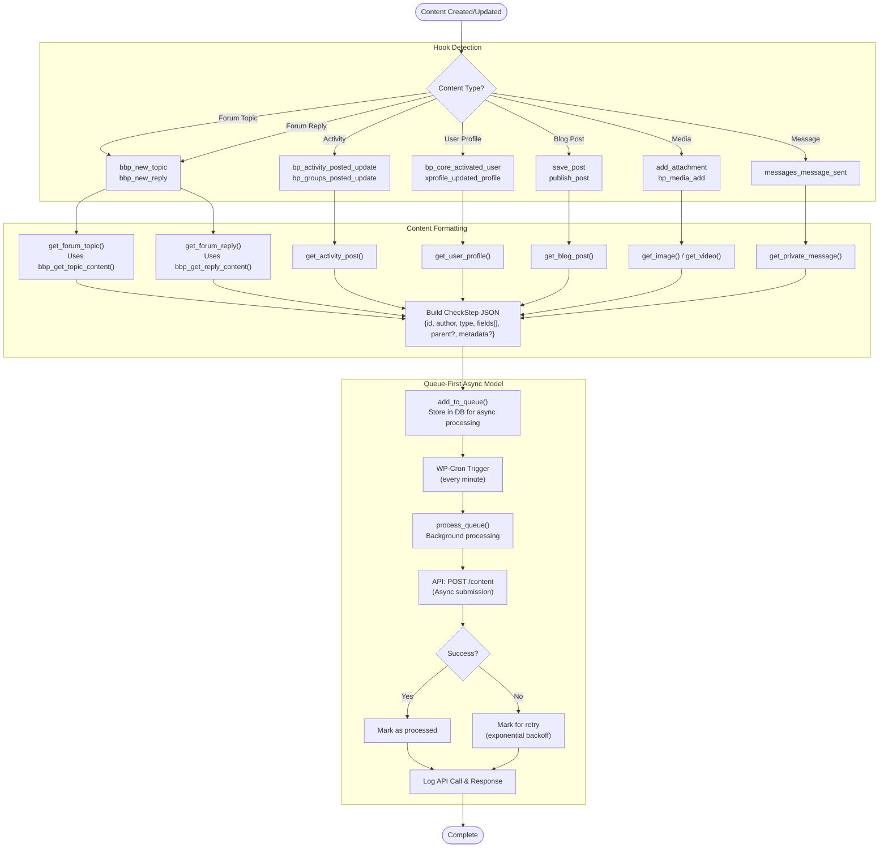
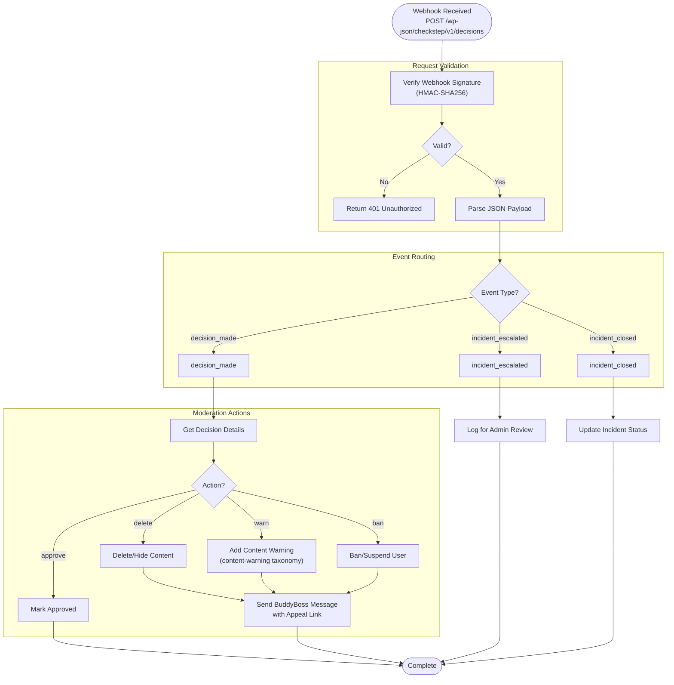
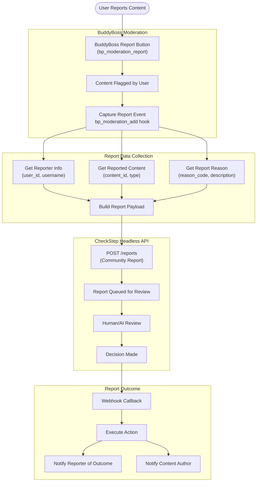
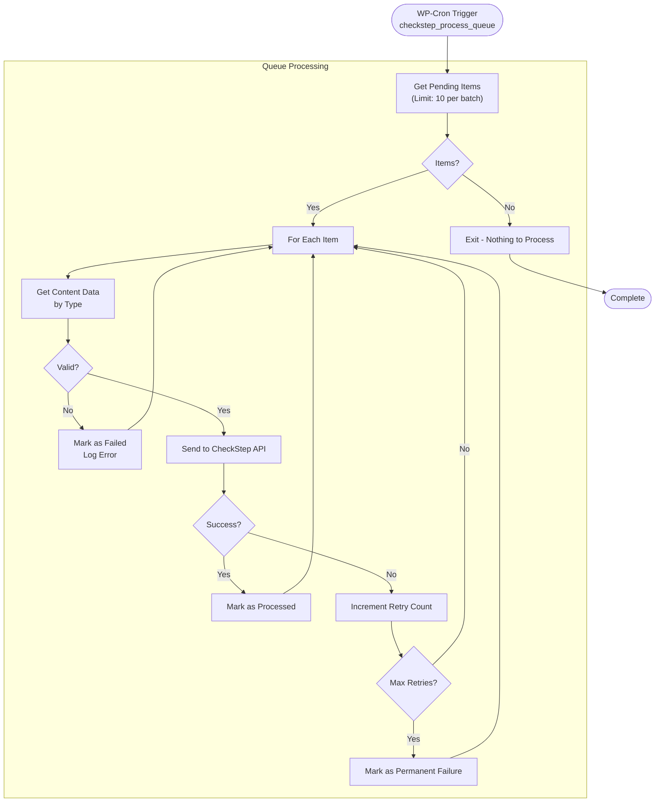
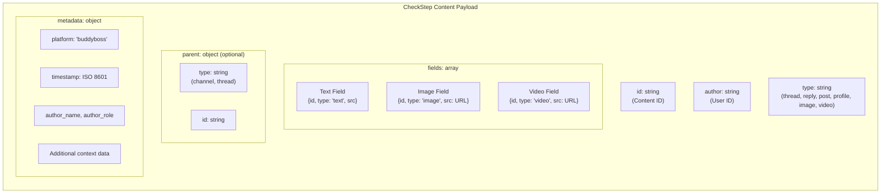
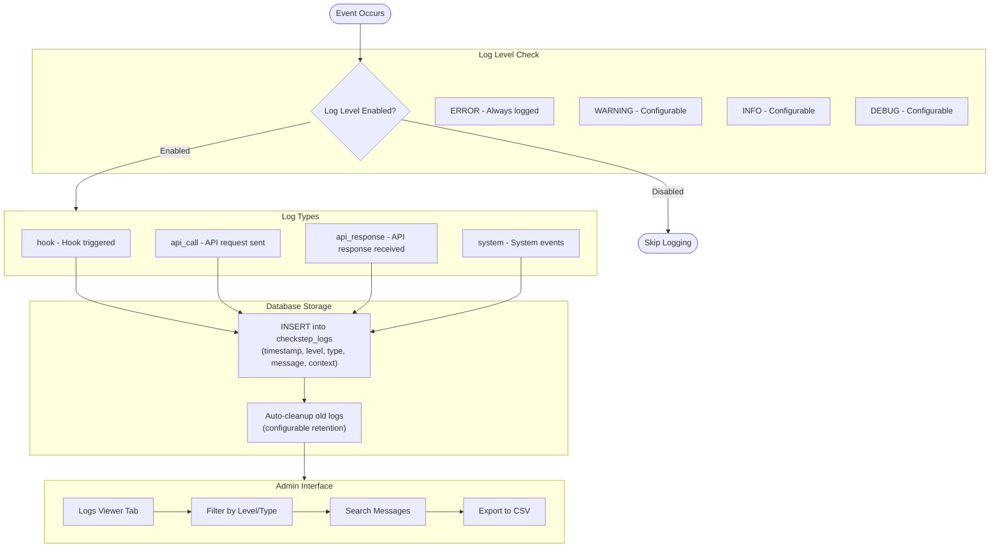
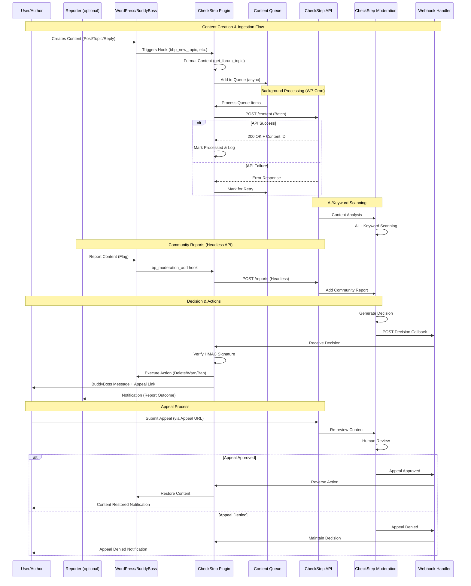

# CheckStep Integration Process Flow

This document provides visual process flow diagrams for the CheckStep WordPress plugin integration with BuddyBoss Platform.

## System Architecture Overview

## Content Ingestion Flow (Asynchronous)

This diagram shows the complete flow from content creation to CheckStep submission.
Per the design specification, all content submission to CheckStep is performed asynchronously
via WP-Cron or background processing to avoid impacting front-end performance.

Note: The current implementation uses a hybrid approach where some hooks (forum posts, user profiles) 
attempt immediate API calls for faster moderation, with queue fallback on failure. The design 
specification recommends full asynchronous queue-first processing for high-traffic sites.

## Webhook Decision Flow

This diagram shows how moderation decisions from CheckStep are processed.

## Community Reports Flow (Headless API)

This diagram shows how community-generated moderation reports from BuddyBoss are forwarded to CheckStep's Headless API.

## Queue Processing Flow

This diagram shows the background queue processing mechanism.

## Content Type JSON Structure

This diagram shows the standard JSON payload structure for CheckStep API.

## Logging System Flow

## Complete System Sequence (with Appeals)

---

## File References

| Component | File |
|-----------|------|
| Main Plugin | `checkstep-integration.php` |
| Ingestion Handler | `includes/class-checkstep-ingestion.php` |
| Content Types | `includes/class-checkstep-content-types.php` |
| API Client | `includes/class-checkstep-api.php` |
| Webhook Handler | `includes/class-checkstep-webhook-handler.php` |
| Moderation Actions | `includes/class-checkstep-moderation.php` |
| Logger | `includes/class-checkstep-logger.php` |
| Admin Settings | `admin/class-checkstep-admin.php` |
| Admin Tab (BuddyBoss) | `admin/class-checkstep-admin-tab.php` |

---

*Generated from Design Document v2025-02-08*
